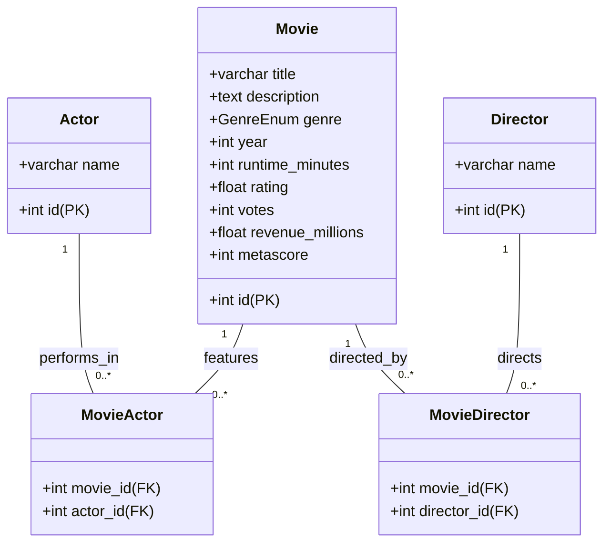

# Agentforce Vibes Demo

This is a demo repository for Agentforce Vibes that feature a sample app for managing movies.

# Data Model

## Movie Object

This object describes a movie.

### Genre Field

The field support the following values:
- Action
- Adventure
- Animation
- Biography
- Comedy
- Crime
- Drama
- Family
- Fantasy
- History
- Horror
- Music
- Musical
- Mystery
- Romance
- Sci-Fi
- Sport
- Thriller
- War
- Western
